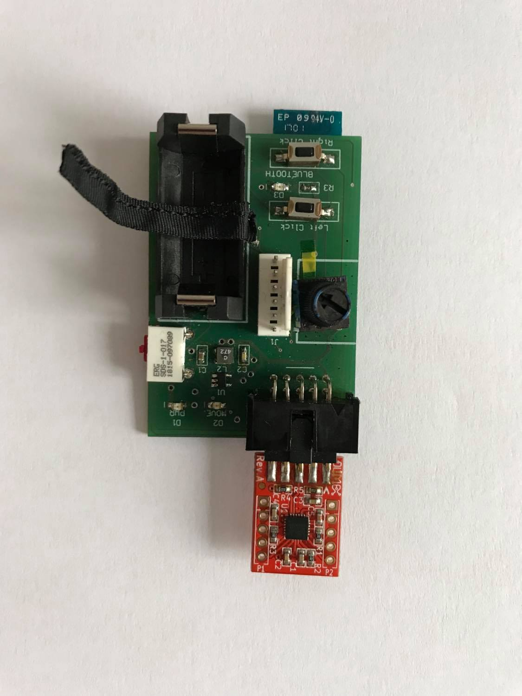
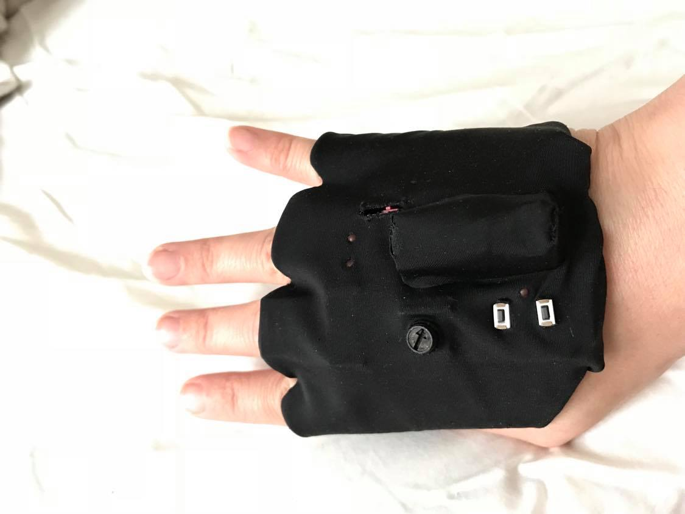

# ThumbsUp !

A hand-worn wireless mouse made by four software developer students at school 42 Paris.
This was our free project to complete the electronics development course at 42's electronic lab.
In the traditional spirit of 42, no external libraries are allowed:
- schematic and footprints libraries were designed from scratch.
- firmware is bare metal working up from CMSIS headers.

## Main hardware components
- [RN42HID Bluetooth 2.1 Module](https://www.microchip.com/wwwproducts/en/RN42)
- [MPU9150 9-DoF sensor](https://www.olimex.com/Products/Modules/Sensors/MOD-MPU9150/open-source-hardware)
- [PIC32MX](https://lmgtfy.com/?q=PIC32+MX+Family)

A BOM is available in the `output_files/BOM` directory.

## Development tools
Altium and MPLAB IDE(xc32 compiler)

## Result
Turned out to be pretty cool and fully functional.

# Authors
- [ade-sede](https://github.com/ade-sede)
- [ssabbah](https://github.com/solalsabbah)
- [asuissa](https://github.com/asuissa)
- [alallema](https://github.com/alallema)
